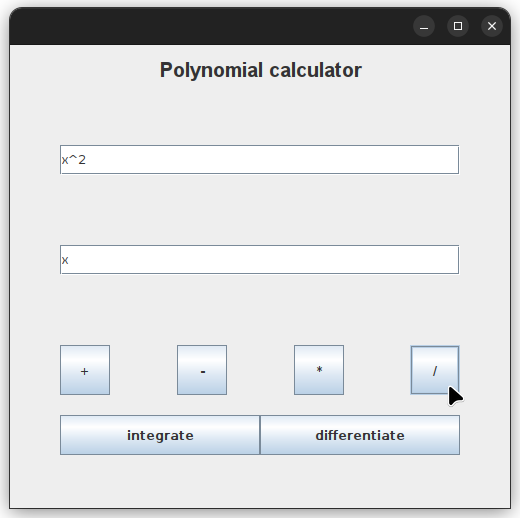
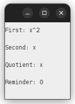

# Polynomial Calculator

## Description

A polynomial calculator with a user-friendly graphical interface for operations
like addition, subtraction, multiplication, division, integration, and
differentiation while also emphasizing testing using JUnit.

## Screenshots

### Divide Two Polynomials





## Getting Started

### Prerequisites

- maven

  Debian/Ubuntu:

  ```sh
  sudo apt install maven
  ```

- java 17 jdk

  Debian/Ubuntu:

  ```sh
  sudo apt install openjdk-17-jdk openjdk-17-jre
  ```

### Installation

1. Clone the repo

   ```sh
   git clone https://github.com/CozmaRares/polynomial-calculator.git
   cd polynomial-calculator
   ```

2. Compile the code

   ```sh
   mvn compile
   ```

3. Run the code

   ```sh
   mvn exec:java
   ```

## Design

In the design of this polynomial calculator, I used the Model-View-Controller (MVC).

In the Model component, the `Polynomial` class stores polynomial data using a
HashMap<Integer, Decimal> data structure. Additionally, each mathematical
operation was encapsulated within its dedicated class, featuring a static
`apply` method to execute the respective operation.

On the View side, the design incorporated a user-friendly graphical user
interface (GUI) handled by a single class responsible for the main application
display. I also introduced a 'popup' class to handle displaying the results or
the errors that may occur during the execution of an operation.

Finally, the Controller component added functionality to the GUI buttons.
This division of responsibilities among the Model, View, and Controller
components adhered to the MVC pattern, that provides a clear separation of
concerns throughout the development of the polynomial calculator.

## Reflection

This polynomial calculator project was undertaken as part of a college
assignment for the Fundamental Programming Techniques class. The primary
objective was to develop a polynomial calculator that includes a user-friendly
graphical interface. This interface will allow users to input polynomials,
choose from various mathematical operations (addition, subtraction,
multiplication, division, integration, differentiation), and view the computed
results.

One of the trickiest parts of the project was figuring out the right regular
expression to read the polynomial input correctly. It was a real puzzle and
required a good understanding of regular expressions and how polynomials are written.

I used Java, Maven for managing the project, JUnit for testing, and Java Swing
for building the graphical interface. These tools were a big help in getting the
job done and making sure our calculator worked as expected.
